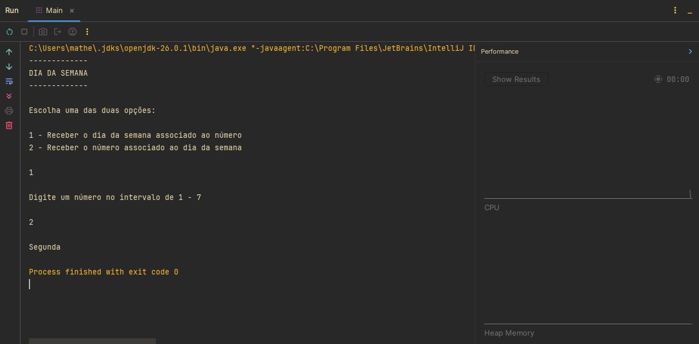
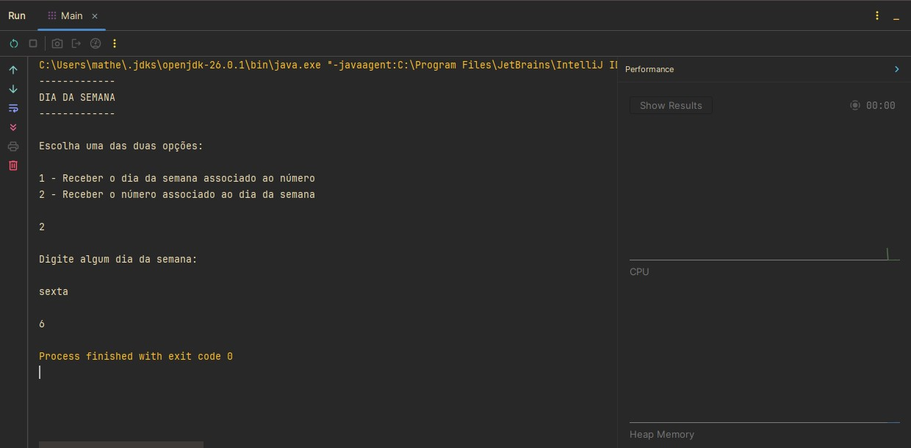

# Conversor de Dias da Semana em Java

Projeto desenvolvido durante meus estudos de **Java** com o objetivo de praticar estruturas condicionais, comparação de `String` e validação de entradas utilizando a linguagem.

## Sobre este repositório

Este repositório faz parte da minha jornada de aprendizado em Java. Meu objetivo é documentar os principais exercícios e projetos desenvolvidos ao longo dos estudos, registrando minha evolução na linguagem e construindo um portfólio para oportunidades de estágio e desenvolvimento de software.

## Descrição

O programa permite realizar conversões entre **números** e **dias da semana**, oferecendo duas funcionalidades distintas.

### Opção 1 – Número ➜ Dia da semana

O usuário informa um número de **1 a 7**, e o programa retorna o dia da semana correspondente.

| Número | Dia     |
| -----: | ------- |
|      1 | Domingo |
|      2 | Segunda |
|      3 | Terça   |
|      4 | Quarta  |
|      5 | Quinta  |
|      6 | Sexta   |
|      7 | Sábado  |

### Opção 2 – Dia da semana ➜ Número

O usuário informa o nome de um dia da semana, e o programa retorna o número correspondente.

A comparação é realizada utilizando o método `equalsIgnoreCase()`, permitindo que o usuário digite o dia em letras maiúsculas ou minúsculas sem alterar o funcionamento da aplicação.

### Validação de entradas

O programa também realiza verificações para evitar entradas inválidas.

São tratadas as seguintes situações:

* escolha de uma opção diferente de **1** ou **2**;
* números fora do intervalo de **1 a 7**;
* nomes de dias da semana inexistentes.

Nesses casos, o programa informa ao usuário que a entrada é inválida, tornando a aplicação mais robusta.

## Tecnologias e conceitos utilizados

* IntelliJ IDEA
* Java
* Scanner
* Locale
* Estruturas condicionais (`if`, `else if` e `else`)
* Comparação de `String` com `equalsIgnoreCase()`
* Variáveis e tipos primitivos
* Entrada e saída de dados
* Validação de entradas

## Demonstração

<p align="center">
  
</p>

<p align="center">
  
</p>

## Estrutura do projeto

```text
java-conversor-dia-semana/
│
├── images/
│   ├── captura1.jpg
│   └── captura2.jpg
│
├── Main.java
│
└── README.md
```

## Objetivo

Praticar conceitos fundamentais da linguagem Java, especialmente:

* leitura de dados utilizando a classe `Scanner`;
* utilização de estruturas condicionais;
* comparação de `String`;
* validação de entradas do usuário;
* utilização do método `equalsIgnoreCase()`;
* organização de programas em Java.

## Aprendizados

Durante o desenvolvimento deste projeto, pratiquei:

* utilização da classe `Scanner`;
* configuração da localidade com `Locale`;
* manipulação de variáveis e tipos primitivos;
* utilização de estruturas condicionais (`if`, `else if` e `else`);
* comparação de `String` utilizando `equalsIgnoreCase()`;
* implementação de validações para entradas inválidas;
* organização básica de um programa em Java.

## Como executar

Clone este repositório:

```bash
git clone https://github.com/SEU-USUARIO/java-conversor-dia-semana.git
```

Acesse a pasta do projeto:

```bash
cd java-conversor-dia-semana
```

Compile o programa:

```bash
javac Main.java
```

Execute:

```bash
java Main
```

## Autor

**Matheus Ferreira Lopes**

Estudante de Desenvolvimento de Software Multiplataforma (FATEC Diadema)
